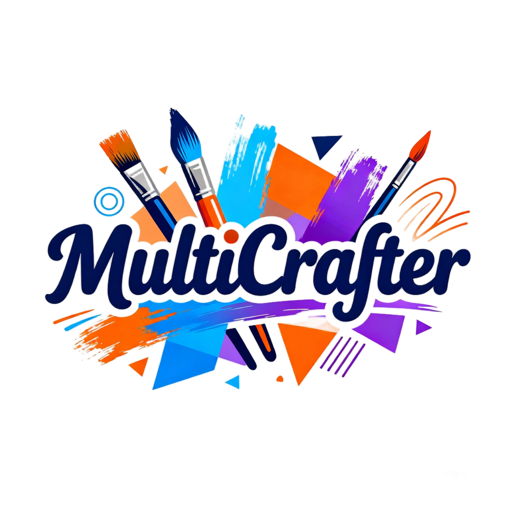
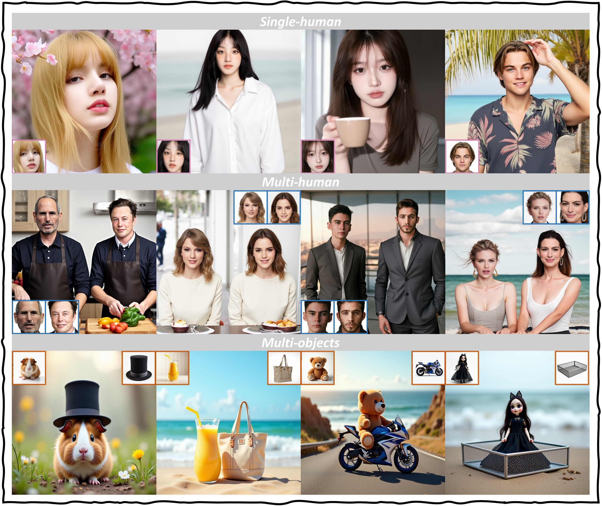

# ✨MultiCrafter✨

<b>MultiCrafter: High-Fidelity Multi-Subject Generation via Spatially Disentangled Attention and Identity-Aware Reinforcement Learning</b>.

</img>

 &nbsp;
  &nbsp;

## 🥳 Demo

Please check more demo videos at the [project page](https://wutao-cs.github.io/MultiCrafter/).

## 🔆 Abstract

> Multi-subject image generation aims to synthesize user-provided subjects in a single image while preserving subject fidelity, ensuring prompt consistency, and aligning with human aesthetic preferences. However, existing methods, particularly those built on the In-Context-Learning paradigm, are limited by their reliance on simple reconstruction-based objectives, leading to both severe attribute leakage that compromises subject fidelity and failing to align with nuanced human preferences. To address this, we propose MultiCrafter, a framework that ensures high-fidelity, preference-aligned generation. First, we find that the root cause of attribute leakage is a significant entanglement of attention between different subjects during the generation process. Therefore, we introduce explicit positional supervision to explicitly separate attention regions for each subject, effectively mitigating attribute leakage. To enable the model to accurately plan the attention region of different subjects in diverse scenarios, we employ a Mixture-of-Experts architecture to enhance the model's capacity, allowing different experts to focus on different scenarios. Finally, we design a novel online reinforcement learning framework to align the model with human preferences, featuring a scoring mechanism to accurately assess multi-subject fidelity and a more stable training strategy tailored for the MoE architecture. Experiments validate that our framework significantly improves subject fidelity while aligning with human preferences better.

## 📌 TODO
We are organizing the code and applying to the company, please be patient
- [x] Release project page
- [] Release inference code
- [] Release model on huggingface
- [] Release huggingface demo
- [] Release training code
